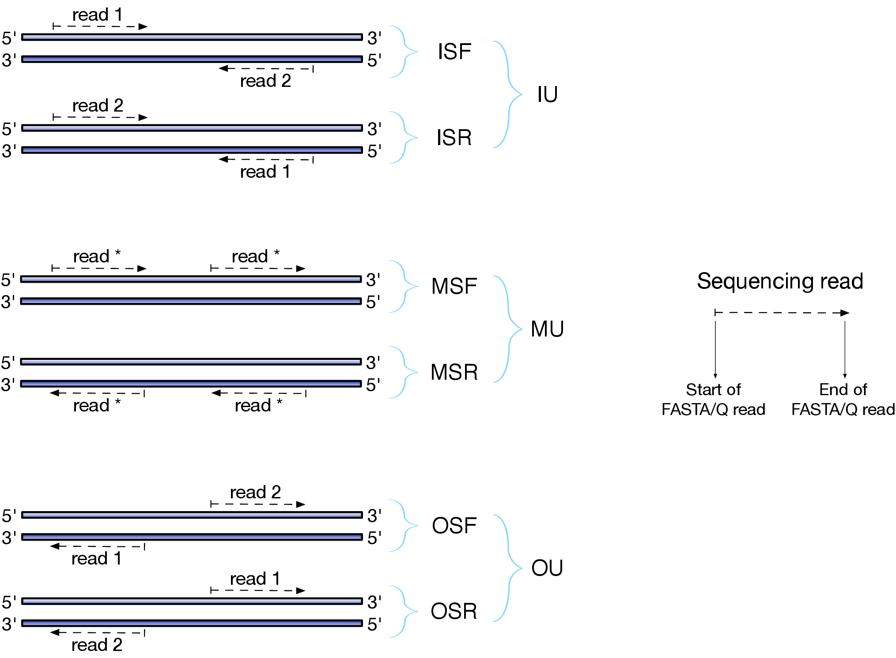

.. _FragLibType:

Fragment Library Types
======================

There are numerous library preparation protocols for RNA-seq that result in
sequencing reads with different characteristics.  For example, reads can be
single end (only one side of a fragment is recorded as a read) or paired-end
(reads are generated from both ends of a fragment).  Further, the sequencing
reads themselves may be unstranded or strand-specific.  Finally, paired-end
protocols will have a specified relative orientation.  To characterize the
various different typs of sequencing libraries, we've created a miniature
"language" that allows for the succinct description of the many different types
of possible fragment libraries.  For paired-end reads, the possible
orientations, along with a graphical description of what they mean, are
illustrated below:

The library type string consists of three parts: the relative orientation of
the reads, the strandedness of the library, and the directionality of the
reads.

The first part of the library string (relative orientation) is only provided if
the library is paired-end. The possible options are:

::

    I = inward
    O = outward
    M = matching

The second part of the read library string specifies whether the protocol is
stranded or unstranded; the options are:

::

    S = stranded
    U = unstranded

If the protocol is unstranded, then we're done.  The final part of the library
string specifies the strand from which the read originates in a strand-specific
protocol — it is only provided if the library is stranded (i.e. if the
library format string is of the form S).  The possible values are:

::

    F = read 1 (or single-end read) comes from the forward strand
    R = read 1 (or single-end read) comes from the reverse strand

So, for example, if you wanted to specify a fragment library of strand-specific
paired-end reads, oriented toward each other, where read 1 comes from the
forward strand and read 2 comes from the reverse strand, you would specify ``-l
ISF`` on the command line.  This designates that the library being processed has
the type "ISF" meaning, **I**\ nward (the relative orientation), **S**\ tranded
(the protocol is strand-specific), **F**\ orward (read 1 comes from the forward
strand).

The single end library strings are a bit simpler than their pair-end counter
parts, since there is no relative orientation of which to speak.  Thus, the
only possible library format types for single-end reads are ``U`` (for
unstranded), ``SF`` (for strand-specific reads coming from the forward strand)
and ``SR`` (for strand-specific reads coming from the reverse strand).

A few more examples of some library format strings and their interpretations are:

::

    IU (an unstranded paired-end library where the reads face each other)

::

    SF (a stranded single-end protocol where the reads come from the forward strand)

::

    OSR (a stranded paired-end protocol where the reads face away from each other,
         read1 comes from reverse strand and read2 comes from the forward strand)

.. note:: Correspondence to TopHat library types 

   The popular `TopHat <http://ccb.jhu.edu/software/tophat/index.shtml>`_ RNA-seq 
   read aligner has a different convention for specifying the format of the library.
   Below is a table that provides the corresponding sailfish/salmon library format
   string for each of the potential TopHat library types:

   +---------------------+-------------------------+  
   | TopHat              | Salmon (and Sailfish)   |
   +=====================+============+============+
   |                     | Paired-end | Single-end | 
   +---------------------+------------+------------+
   |``-fr-unstranded``   |``-l IU``   |``-l U``    |          
   +---------------------+------------+------------+
   |``-fr-firststrand``  |``-l ISR``  |``-l SR``   |          
   +---------------------+------------+------------+
   |``-fr-secondstrand`` |``-l ISF``  |``-l SF``   |          
   +---------------------+------------+------------+

   The remaining salmon library format strings are not directly expressible in terms
   of the TopHat library types, and so there is no direct mapping for them.

