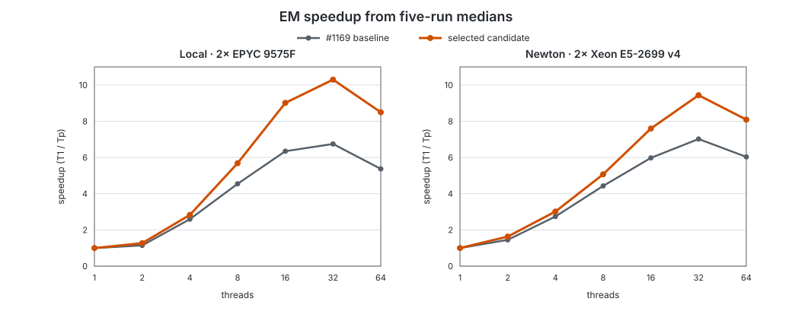

# The EM/VBEM phase: deterministic thread-scaling optimization

This is the implementation and measurement record for the deterministic EM
thread-scaling work stacked on #1169. It describes the final layout, the
floating-point-order constraints, the candidates that were retained or
rejected, and the exact two-host benchmark protocol used for the decision.

The work started at `74ef60f6`, the head of #1169 (which itself depends on
#1167). After #1169 merged, it was rebased without content changes onto the
resulting `develop` merge commit `adbbaee6`, as required. Exact pre-rebase
measurement and final review commit ids are:

| stage | measured id | final rebased id |
|---|---|---|
| benchmark harness | `4c8b0a98` | `f45ec7a2` |
| compressed incidence-balanced shards | `53e46fb7` | `dfbeb1f9` |
| deterministic vector/bootstrap work | `1c0bd08c` | `61d8ff05` |
| complete equivalence-class ordering | `0f9bc742` | `2477cd28` |
| selected 128-shard cap | `04c0a93b` | `27c19a71` |
| posterior timing in harness | `b24dbb9d` | `9191b4f1` |

---

## 1. Why this phase matters

On a 26.1M-fragment sketch run against GENCODE v49 (238,442 transcripts), the
wall time splits roughly:

| phase | time | share |
|---|---|---|
| phase 1 — mapping (includes writing the intermediate RAD) | 30.5 s | 45% |
| phase 2 — **EM inference** | 31.9 s → **15.2 s after #1167** | 47% → ~31% |
| phase 2 — RAD read | 3.9 s | 6% |
| index load, eff-length collapse, posterior, output | ~1.5 s | 2% |

Before #1167 the EM was as expensive as all of mapping. It is now roughly half
that, and it is still the second-largest cost and the one that scales worst.

Measured on `newton` (2× Xeon E5-2699 v4, 44 physical cores/88 hardware
threads); see §7 for the data.

---

## 2. Where the EM sits

Two entry points, both in `crates/salmon-infer/src/lib.rs`:

- `optimize(...)` — builds a `PackedEqClasses` from a `CollapsedEqClasses` and
  runs to convergence.
- `optimize_packed_with_init(p, opts, parallel, init_alphas, eff_lens)` — the
  one production actually calls, with `parallel = true` everywhere (reads mode
  `salmon-quant/src/lib.rs:1039,1041,1249`; RAD/alignment
  `salmon-align/src/rad.rs:2214,2216,2294` and `salmon-align/src/lib.rs:2461,2463,2500`).

Both funnel into **`run_em_counts(p, counts, opts, parallel, min_iter, init_alphas, eff_lens)`**
(`lib.rs:279`), which owns the buffers, builds the shard plan, selects the
M-step kernel, and drives one of three convergence loops.

These two arguments used to be a live footgun: `init_alphas` precedes
`eff_lens`, both were `Option<&[f64]>`, and swapping them type-checked
silently. It shipped that way once — the bootstrap path passed effective
lengths into the `init_alphas` slot, which left `--perNucleotidePrior` inert
inside every replicate *and* warm-started each replicate from the
effective-length vector, so the reported spread was drawn under a different
prior than the point estimate it quantified.

**That is now a compile error.** They are distinct newtypes,
`InitAlphas<'a>` and `EffLens<'a>`, each wrapping `Option<&'a [f64]>`:

```rust
run_em_counts(p, counts, opts, parallel, min_iter,
              InitAlphas::NONE,            // or InitAlphas::new(&warm)
              EffLens::new(&eff_lengths))  // or EffLens::NONE
```

Three properties are worth preserving if you touch them:

- **Zero overhead is asserted, not assumed** — a `const _: () = assert!(...)`
  in `lib.rs` checks that both newtypes have the same layout as
  `Option<&[f64]>` (16 bytes). If a future change makes them fatter, the crate
  stops compiling.
- **The swap is proven impossible** by a `compile_fail` doctest on
  `InitAlphas`, which runs under `cargo test --doc` and doubles as API
  documentation. Weakening the types breaks that test.
- **No `Deref`, no `Into<Option<..>>`** — deliberately. An implicit conversion
  back to the bare type would reopen the hole. The accessor is `pub(crate)`.

### Callers with different needs

- **Point estimate** — `parallel = true`, full iteration budget.
- **Bias seed EM** (`salmon-quant/src/lib.rs:1039`) — a deliberately
  under-converged short run (`min_iter = max_iter = bias_seed_em_iters`,
  `min_alpha = 0.0`) whose output seeds the bias model.
- **Bootstrap replicates** (`uncertainty.rs:136`) — `parallel = false`, because
  the *replicates* are the parallel dimension; each replicate runs a sequential
  EM inside a `par_iter` over replicates. Optimizing the sequential kernel
  therefore matters as much as the parallel one for `--numBootstraps` runs.
- **Gibbs** (`uncertainty.rs`) — separate sampler, shares `PackedEqClasses`
  and the `weights` array rather than `combined`.

---

## 3. The data structure: `PackedEqClasses` (CSR)

`crates/salmon-infer/src/packed.rs`. Flat CSR, built once per run:

```
labels:   Vec<u32>   flat transcript ids; class i spans labels[starts[i]..starts[i+1]]
starts:   Vec<u64>   CSR offsets, len = num_classes + 1
combined: Vec<f64>   weight/effLen per (class, transcript) incidence — EM reads this
weights:  Vec<f64>   raw conditional weights, same layout — Gibbs reads this
counts:   Vec<u64>   per-class fragment count
num_txps: usize
```

`starts` is `u64` deliberately: these are cumulative *incidence* counts, and a
`u32` wrapped silently past 4G incidences and handed the optimizer slices
belonging to other classes (#1097). Costs ~3.5% of the structure.

Scale on the reference dataset: **536,311 classes, 238,442 transcripts**, mean
class size 12.9, and **6,933,617 incidences**. Each M-step reads every incidence
twice (denominator, then distribution) — about 13.9M f64 reads of `combined` plus
the same number of scattered reads of `alpha_in` and scattered writes to an
accumulator.

`weights` is populated only when a posterior method needs it
(`PosteriorMethod::needs_raw_weights`); a point-estimate run does not pay for
it.

---

## 4. The M-step kernels

Four, dispatched by `(use_vbem, parallel)` in the closure at `lib.rs:~300`:

| | sequential | parallel |
|---|---|---|
| EM | `em_step_seq` | `em_step_par` |
| VBEM | `vbem_step_seq` | `vbem_step_par` |

**Plain EM**, per class `ci` with `count` fragments and members `(tid, w)`:

```
denom = Σ alpha_in[tid] * w
if denom > MIN_EQ_CLASS_WEIGHT:
    inv = count / denom
    for each (tid, w): acc[tid] += alpha_in[tid] * w * inv
```

Single-member classes short-circuit to `acc[tid] += count`. The inner product
is recomputed rather than cached in scratch — the multiply was measured cheaper
than the extra memory traffic inside the parallel closure.

**VBEM** substitutes `exp_theta` for `alpha`:
`exp_theta[i] = exp(digamma(alpha_i + prior_i) − digamma(Σ_j alpha_j + prior_j))`,
computed by `fill_exp_theta` once per M-step. The point-estimate execution mode
keeps the global sum in its historical sequential order, then evaluates the
independent `digamma`/`exp` map in parallel. Bootstrap replicates use a wholly
sequential execution mode because the replicate iterator is already the
parallel dimension. A fixed-chunk parallel sum was measured and rejected; see
§8.

Priors come from `prior_alphas_vec` (`lib.rs:241`): flat `vb_prior` per
transcript, or `vb_prior * max(1, effLen)` under `--perNucleotidePrior`.

**VBEM is the production default** (`opt_type: "vb"`; the CLI sets
`use_vbem = !args.use_em && !args.meta`). `EmOptions::default()` has
`use_vbem: false`, so any benchmark or test built on the default is exercising
the *non*-default kernel. This mattered: the original determinism test did
exactly that.

---

## 5. Parallelism: the compressed `ShardPlan`

### What it was

```rust
let nshards = rayon::current_num_threads().clamp(1, 64);
// per shard, per iteration:
buf.iter_mut().for_each(|x| *x = 0.0);      // dense clear,  O(num_txps)
...
reduce_shards(shards, alpha_out);            // dense reduce, O(nshards * num_txps)
```

Each shard owned a private dense `num_txps` accumulator and processed a
contiguous slice of classes with non-atomic adds — chosen over a shared
`AtomicF64` array, which contended badly on hot transcripts.

**Two defects.**

1. **Determinism.** `nshards` tracked the thread count, so `-p` changed the
   class partition and therefore the grouping of floating-point sums. On real
   data `-p 4` and `-p 32` produced different `quant.sf`, *at default
   precision*. Confirmed by construction: `-p 64` and `-p 80` (both clamped to
   64) were byte-identical; `-p 16` differed.
2. **Scaling.** Clear + reduce cost `O(nshards × num_txps)` per iteration
   regardless of the data — ~30M ops at 64 shards against 6.9M incidences of
   real work — and grew with thread count while the work stayed fixed.

### Final layout

`ShardPlan` (`packed.rs`) is now built once from the packed data and contains:

- `boundaries: Vec<usize>` — contiguous class ranges chosen at equal
  cumulative-incidence targets. A class is never split.
- `local_lens: Vec<usize>` — the exact compressed accumulator length for each
  shard.
- `entry_local: Vec<u32>` — one local accumulator index aligned with every
  packed incidence. The repeated M-step therefore performs a direct indexed
  add, with no binary search or hash lookup.
- `contrib_start: Vec<u64>` and contributor records `(u16 shard, u32 local)` —
  the transcript-to-shard CSR used by reduction. The `u64` offsets and checked
  conversions preserve the packed layout's support beyond 4G incidences.

Sorted, deduplicated touched-transcript vectors exist only while the plan is
constructed. They build `entry_local` and the contributor CSR, then are
dropped. Each iteration clears each compressed accumulator contiguously,
accumulates classes in class order, and reduces each transcript through its
contributors in ascending shard order.

The selected constants are:

```rust
MAX_SHARDS = 128
MIN_INCIDENCES_PER_SHARD = 4096
```

The shard count is
`ceil(total_incidences / 4096).clamp(1, min(128, num_classes))`. Neither it nor
the boundaries inspect the Rayon pool or `-p`; Rayon only schedules the fixed
logical shards. Per-iteration buffer clear and reduction work is
`O(Σ|touched|)`, on the order of incidence count, instead of
`O(nshards × num_txps)`.

On the measured RAD, the 128 compressed accumulators contain 368,110 `f64`
slots in total: 2.81 MiB versus 116.43 MiB for #1169's 64 dense buffers. The
retained local-index and contributor structures bring the complete final plan
plus buffers to about 33.9 MiB (`entry_local` alone is 26.45 MiB for 6,933,617
incidences). Construction-only touched vectors are not retained.

There is one upstream ordering requirement: range-factorized equivalence
classes are sorted by the complete `(txps, bins)` identity. Sorting only by
`txps` left ties in `DashMap` iteration order, which changed otherwise-fixed
shard groupings. Commit `2477cd28` fixes that latent source of
cross-thread-count nondeterminism.

### Determinism invariants (do not break these)

Any future change must preserve all five, or `quant.sf` stops being
reproducible across `-p`:

1. The packed class order is deterministic over the complete class identity.
2. Shard count and boundaries depend only on the data.
3. Each shard's accumulation order over its classes is fixed.
4. The reduction sums a transcript's contributors in a fixed (ascending shard)
   order.
5. Any parallel vector reduction uses a data-fixed partition and fixed final
   order, never a pool-dependent fold/reduce.

Structural tests prove that ranges cover every class exactly once, compressed
indices map back to the correct transcript, contributor lists are ascending,
and empty and skewed inputs are valid. Test-only dense reference kernels use
the same boundaries and must match compressed one-step EM and VBEM bit for
bit. Full `EmResult` values are compared bit for bit across explicit Rayon
pools of 1/2/3/8/16 threads for plain EM and VBEM with `None`, SQUAREM, and
DAAREM acceleration, plus per-nucleotide VBEM. A RAD integration test provides
the end-to-end thread-count invariant.

---

## 6. Convergence and acceleration

### The loop

`max_rel_diff(alpha_in, alpha_out, cutoff)` (`lib.rs:~250`) — max over
transcripts of `|out−in|/out`, considering only transcripts with
`alpha_in > alpha_check_cutoff` (without the cutoff a transcript oscillating
between 1e-30 and 2e-30 blocks convergence forever). The parallel path divides
the vectors into fixed 2,048-element chunks, computes one maximum per chunk,
and combines those maxima in ascending chunk order. Its scratch vector is
allocated once and reused. The exact sequential qualification semantics are
preserved: zero denominators do not qualify, NaNs never replace a current
maximum, and no qualifying transcript returns negative infinity.

Buffers are swapped, not copied. `min_iter` floors the convergence check;
`max_iter` is the hard stop.

### Acceleration (`EmAccel`)

- **`None`** (default) — plain fixed-point iteration, one M-step per iteration.
  Output unchanged from historical salmon.
- **`Squarem`** (SqS3) — per cycle: two M-steps `x1=F(x0)`, `x2=F(x1)`, form
  `r = x1−x0` and `v = (x2−x1)−r`, extrapolate
  `xp = x0 − 2αr + α²v` with `α = −‖r‖/‖v‖` clamped to `α ≤ −1`, halving back
  toward −1 if any component goes negative; then a stabilizing third M-step
  `x_next = F(xp)`. Three M-steps per cycle, far fewer cycles. Not
  byte-identical to `None` (different iterate sequence, same fixpoint within
  `rel_diff_tol`).
- **`Daarem`** — damped Anderson acceleration with restarts and
  residual-monotonicity control over a window of recent iterates
  (`daarem.rs`, 539 lines). Better than SQUAREM on ill-conditioned,
  high-dimensional problems.

SQUAREM and DAAREM inherit the parallel fixed-chunk convergence maximum. Their
norm and dot-product arithmetic remains sequential over `num_txps`
deliberately; restructuring those reductions is follow-up scope so this change
does not alter their floating-point trajectories.

### Finalization

`finalize_truncate_redistribute` (`lib.rs:~265`) — applies `min_alpha`
truncation as a *mass-preserving redistribution* (a masked final M-step over
the surviving members), not a rescale. Mass that cannot be redistributed
(fully-truncated classes) is reported as `inference_truncated_mass`. A
non-positive `min_alpha` makes it a no-op (used by the bias warm-up).

---

## 7. What has been done, with measurements

| change | effect | where |
|---|---|---|
| CSR `PackedEqClasses` replacing per-class `Vec`s | (pre-existing) | `packed.rs` |
| Per-shard dense accumulators replacing a shared `AtomicF64` array | removed CAS contention on hot transcripts | `packed.rs` |
| `u64` CSR offsets | correctness past 4G incidences (#1097) | `packed.rs` |
| SQUAREM, DAAREM | opt-in, far fewer M-steps | `lib.rs`, `daarem.rs` |
| `InitAlphas` / `EffLens` newtypes | made the argument-swap bug a compile error | `lib.rs` |
| **Data-derived shard count** (#1167) | **fixed cross-`-p` reproducibility** | `packed.rs` |
| **Sparse clear via `touched`** (#1167) | see below | `packed.rs` |
| **Parallel sparse reduce via CSR inversion** (#1167) | see below | `packed.rs` |
| **Compressed shard buffers + direct local indices** (`dfbeb1f9`) | removes dense accumulator working set and hot-loop lookup | `packed.rs` |
| **Incidence-balanced, fixed 128-shard cap** (`27c19a71`) | reduces class-size tail imbalance | `packed.rs` |
| **Fixed-chunk convergence maximum** (`61d8ff05`) | removes a per-iteration serial vector pass | `lib.rs`, `daarem.rs` |
| **Parallel point-estimate VBEM map / sequential replicate mode** (`61d8ff05`) | speeds production VBEM without nested Rayon | `packed.rs` |
| **Complete range-factorized class ordering** (`2477cd28`) | removes `DashMap` tie-order nondeterminism | `salmon-eqclass` |

EM phase time, newton, same binary pair, back to back, sketch, 26.1M fragments:

| `-p` | before #1167 | after #1167 | |
|---|---|---|---|
| 16 | 32.58 s | **15.19 s** | 2.14× |
| 32 | 23.69 s | **13.95 s** | 1.70× |

Mapping and RAD-read unchanged, so the effect is isolated to this phase.

End-to-end wall on an EPYC 9575F (10M-pair equivalent workload, sketch):
`-p 4` 1.03×, `-p 16` 1.06×, `-p 32` 1.14×, `-p 64` 1.17×.

### Selected build: five-repetition RAD A/B

Values are median ± MAD. RSS is MiB; speedup is `T1/Tp` from the same arm and
efficiency is speedup divided by thread count. Complete per-run data are in
[`benchmarks/em-thread-scaling/`](benchmarks/em-thread-scaling/).

Local, dual-socket EPYC 9575F:

| `-p` | EM baseline (s) | EM candidate (s) | wall baseline (s) | wall candidate (s) | RSS baseline | RSS candidate | speedup B / C | efficiency B / C |
|---:|---:|---:|---:|---:|---:|---:|---:|---:|
| 1 | 51.271±0.052 | 50.325±0.044 | 69.85±0.03 | 68.98±0.07 | 669.0±9.7 | 642.2±8.6 | 1.000 / 1.000 | 100.0% / 100.0% |
| 2 | 44.643±1.908 | 39.752±4.598 | 52.73±0.96 | 48.95±4.39 | 670.9±7.5 | 673.5±18.8 | 1.148 / 1.266 | 57.4% / 63.3% |
| 4 | 19.765±0.412 | 17.786±1.039 | 23.58±0.22 | 22.06±0.61 | 751.5±21.9 | 727.0±3.0 | 2.594 / 2.829 | 64.9% / 70.7% |
| 8 | 11.274±0.277 | 8.853±0.317 | 14.34±0.31 | 11.96±0.80 | 849.4±2.3 | 880.1±20.4 | 4.548 / 5.685 | 56.8% / 71.1% |
| 16 | 8.076±0.259 | 5.583±0.164 | 9.84±0.34 | 7.32±0.10 | 1069.8±13.1 | 1058.6±9.0 | 6.349 / 9.013 | 39.7% / 56.3% |
| 32 | 7.602±0.218 | 4.886±0.170 | 9.10±0.21 | 6.42±0.19 | 1114.1±4.2 | 1110.0±3.9 | 6.745 / 10.300 | 21.1% / 32.2% |
| 64 | 9.547±0.150 | 5.921±0.149 | 11.09±0.31 | 7.42±0.08 | 1398.5±22.1 | 1422.6±12.3 | 5.371 / 8.499 | 8.4% / 13.3% |

Newton, dual-socket Xeon E5-2699 v4:

| `-p` | EM baseline (s) | EM candidate (s) | wall baseline (s) | wall candidate (s) | RSS baseline | RSS candidate | speedup B / C | efficiency B / C |
|---:|---:|---:|---:|---:|---:|---:|---:|---:|
| 1 | 94.517±0.196 | 94.029±0.178 | 129.59±0.18 | 128.90±0.17 | 653.5±7.1 | 610.0±4.9 | 1.000 / 1.000 | 100.0% / 100.0% |
| 2 | 64.989±0.577 | 57.576±0.229 | 82.93±0.70 | 74.69±1.43 | 665.4±2.9 | 662.5±21.8 | 1.454 / 1.633 | 72.7% / 81.7% |
| 4 | 34.463±0.225 | 31.174±0.018 | 41.92±0.18 | 38.43±0.19 | 702.6±4.7 | 715.1±5.0 | 2.743 / 3.016 | 68.6% / 75.4% |
| 8 | 21.337±0.146 | 18.547±0.012 | 25.70±0.10 | 22.99±0.05 | 818.1±3.0 | 806.1±6.4 | 4.430 / 5.070 | 55.4% / 63.4% |
| 16 | 15.811±0.063 | 12.374±0.029 | 20.03±0.06 | 16.72±0.07 | 1031.0±12.6 | 911.7±20.5 | 5.978 / 7.599 | 37.4% / 47.5% |
| 32 | 13.464±0.006 | 9.963±0.053 | 17.68±0.11 | 14.24±0.03 | 1128.8±18.6 | 1009.5±10.9 | 7.020 / 9.438 | 21.9% / 29.5% |
| 64 | 15.666±0.216 | 11.621±0.315 | 20.10±0.26 | 16.00±0.32 | 1331.6±30.6 | 1342.9±7.4 | 6.033 / 8.091 | 9.4% / 12.6% |

The 16/32/64-thread EM geometric mean fell from 8.369 to 5.446 s locally
(**34.9%**) and from 14.940 to 11.273 s on newton (**24.5%**). The 16→32
scaling ratio improved from 1.062 to 1.143 locally and from 1.174 to 1.242 on
newton. At the protected low-thread points, candidate EM time improved by 1.8%
and 10.0% locally and by 0.5% and 9.5% on newton at 1 and 4 threads,
respectively.

The candidate produced exactly one `quant.sf` hash across every thread count on
each host: `2a86764f...f6860a3` locally and `6cc0241a...7a8710` on newton. All
70 candidate runs converged in 2811 iterations. Against the corresponding
baseline one-thread output, normalized L1 count difference was
`4.7980e-16` local / `3.7317e-16` newton and maximum symmetric relative
difference above the 0.01-count convergence cutoff was `1.1440e-10` /
`2.2518e-11`. Every count was finite and nonnegative; total mass was conserved
at 18,760,450 fragments. No fallback to #1169's class-balanced boundaries was
needed.

The baseline produced one stable hash per thread count rather than one per
host. That exposed the range-factorized `(txps, bins)` tie-order defect fixed
by `2477cd28`; the candidate end-to-end determinism result therefore validates
both the fixed plan arithmetic and its packed-input ordering.

One process-wide generic `perf stat` run per high-thread point produced the
following counters. Values are baseline / candidate in billions; the isolated
EM-time change from that same run is included. These are aggregate counters
across all workers and all RAD-quantification phases, so a candidate can spend
more total cycles while completing sooner by keeping more cores useful.

| host | `-p` | EM change | cycles (G) | instructions (G) | cache misses (G) |
|---|---:|---:|---:|---:|---:|
| local | 16 | -34.1% | 417.9 / 416.6 | 1145.0 / 1133.5 | 1.350 / 0.921 |
| local | 32 | -35.2% | 663.4 / 662.9 | 1186.4 / 1162.0 | 2.397 / 1.897 |
| local | 64 | -42.5% | 1786.1 / 1599.1 | 1317.8 / 1268.7 | 7.344 / 6.200 |
| newton | 16 | -22.5% | 569.1 / 571.3 | 1072.2 / 1054.1 | 3.790 / 4.933 |
| newton | 32 | -24.5% | 764.7 / 833.6 | 1131.4 / 1114.0 | 3.963 / 4.903 |
| newton | 64 | -24.5% | 1698.5 / 1915.2 | 1295.4 / 1291.0 | 4.291 / 4.607 |



---

## 8. Selection gates, rejected candidates, and follow-up scope

Four fixed configurations were built from the same production changes and
timed at 16/32/64 threads on both hosts. Each cell below is the geometric mean
of the three median EM times; the final column combines the two host values.

| partition | local EPYC | newton | combined | vs best |
|---|---:|---:|---:|---:|
| compressed 64, class-balanced | 5.762 s | 13.121 s | 8.695 s | +12.72% |
| compressed 64, incidence-balanced | 5.751 s | 12.200 s | 8.376 s | +8.59% |
| compressed 128, incidence-balanced | 5.375 s | 11.207 s | 7.761 s | +0.61% |
| compressed 256, incidence-balanced | 5.412 s | 10.994 s | **7.714 s** | best |

The 128- and 256-shard configurations differ by only 0.61%, below the
pre-declared 2% tie threshold, so the lower 128-shard cap is selected. The
minimum 4,096 incidences per shard remains in every configuration. These are
data constants, not adaptive tuning based on the available pool.

Other decisions:

- A fixed-chunk parallel reduction for VBEM's global alpha/prior sum was
  rejected. It improved neither the incremental kernel nor the required 3%
  gate and regressed the 16-thread kernel by about 5.1%. The historical
  sequential sum stays; only the point-estimate element map is parallel.
- Fully sequential work inside each bootstrap replicate was retained. With 32
  replicates, median posterior time fell from 123.50 to 99.06 s at 16 threads
  (19.8%) and from 55.87 to 52.87 s at 32 threads (5.4%). The sequential
  50-step VBEM kernel improved about 25%. This gate used production commit
  `2477cd28` (measured before the rebase as `0f9bc742`); the later 128-vs-256
  change affects only the parallel shard plan,
  which a sequential bootstrap replicate never constructs, so the posterior
  code executed is identical to the selected build.
- A shared atomic accumulator remains rejected: CAS contention on hot
  transcripts dominated. Caching `alpha_in[tid] * w` in per-class scratch also
  remains rejected because its extra memory traffic cost more than the
  recomputed multiply.
- Shard count or boundaries must never track threads; that changes arithmetic
  grouping and violates the primary contract.

The next plausible target is the still-sequential SQUAREM/DAAREM norm and dot
work. It needs an independently measured, data-fixed reduction design and is
intentionally left for a follow-up. A single exceptionally large equivalence
class also remains indivisible; addressing that would change within-class
summation and therefore needs a separate determinism design.

---

## 9. Test data, hosts, and reproduction protocol

**Dataset**: SRR21186103, human, paired-end 2×~100 bp, **26,135,185 fragments**,
71.8% mapping rate against GENCODE v49. The source reads are
`/scratch1/rob/rshash_testing/human_reads/SRR21186103_{1,2}.fastq.gz` locally
and `/mnt/scratch7/rob_disktest/data/` on newton. The indexes are respectively
`/scratch1/rob/flex_bench/salmon_idx/gencode_v49` and the `gencode_v49`
directory beside newton's reads.

The reusable RAD contains 18,760,450 mapped fragments and produces **536,311
equivalence classes**, **6,933,617 incidences**, 238,442 transcripts, and **2811
VBEM iterations** to convergence.

| host | processors used | memory | RAD path | RAD SHA-256 |
|---|---|---:|---|---|
| local | 2× AMD EPYC 9575F, 64 physical cores/socket, SMT2 | 1.5 TiB | `target/em-scaling/local-workload.rad` | `fe481b65ed77fd6caaead6e3a335ba2231fa5602d878e2504e327e76619cc881` |
| newton | 2× Intel Xeon E5-2699 v4, 22 physical cores/socket, SMT2 | 504 GiB | `/mnt/scratch7/rob_disktest/em-thread-scaling/workload.rad` | `68fc76dcb12500cfd3e1e6c295f8c9912d6a3d055a3d1f0dc3aae9664ab4fcc4` |

Baseline was measured at `4c8b0a98` (final equivalent `f45ec7a2`; benchmark-only
changes over #1169), binary SHA-256
`8403ea67f0a0ac2357a7febe5e7eff2c577dec98806ffab0464b8db6211a5f65`.
Candidate production was measured at `04c0a93b` (final equivalent `27c19a71`),
binary SHA-256
`ee24a92ac239392e554e10d8ce658eecdc49f14ff1e72d8c8d0eabe650e4b802`.
Those binary hashes are identical on the two hosts because the same release
artifacts were copied to newton.

### Reproducing the measurement

Create one RAD per host, then reuse it for every arm. The local command was:

```bash
target/release/salmon quant \
  -i /scratch1/rob/flex_bench/salmon_idx/gencode_v49 -l A \
  -1 /scratch1/rob/rshash_testing/human_reads/SRR21186103_1.fastq.gz \
  -2 /scratch1/rob/rshash_testing/human_reads/SRR21186103_2.fastq.gz \
  -p 64 --sketch --writeRad target/em-scaling/local-workload.rad \
  -o target/em-scaling/local-rad-build
```

`scripts/bench_em_rad.sh` performs an unrecorded warmup for both binaries,
uses explicit `1,2,4,8,16,32,64` thread counts, and alternates arm order for
five repetitions. It records `em_bias`, `posterior`, RAD-read and wall time,
user/system CPU time, peak RSS, iteration/convergence metadata, and the
`quant.sf` SHA-256.

```bash
scripts/bench_em_rad.sh \
  --baseline target/em-scaling/bin/salmon-4c8b0a98 \
  --candidate target/em-scaling/bin/salmon-04c0a93b \
  --rad target/em-scaling/local-workload.rad \
  --out target/em-scaling/local-ab-04c0a93b \
  --cpu-order 0,64,1,65,2,66,3,67,4,68,5,69,6,70,7,71,8,72,9,73,10,74,11,75,12,76,13,77,14,78,15,79,16,80,17,81,18,82,19,83,20,84,21,85,22,86,23,87,24,88,25,89,26,90,27,91,28,92,29,93,30,94,31,95
```

Newton uses physical cores from both sockets first
(`0,22,1,23,...,21,43`), followed by SMT siblings for 64-thread runs
(`44,66,45,67,...,53,75`). Generic counters were collected separately with:

```bash
perf stat -x $'\t' -e cycles,instructions,cache-misses -- \
  taskset -c "$AFFINITY" "$BINARY" quant --rad "$RAD" -l A \
  -p "$THREADS" --sigDigits 9 -o "$OUT"
```

On a RAD-only invocation, the timed phases are `rad_read`, `em_bias`,
`posterior`, and `output`; the harness extracts the last occurrence of each
named phase after stripping ANSI escapes.

Kernel/loop selection (verified against `salmon quant --help`):

| flag | effect |
|---|---|
| *(none)* | VBEM — **the production default** |
| `--useEM` | plain EM kernel |
| `--meta` | plain EM + no range factorization (overrides `--useEM`) |
| `--emAccel none\|squarem\|daarem` | convergence loop; `none` is the default |
| `--perNucleotidePrior` | VBEM prior becomes `vb_prior * effLen` |
| `--numBootstraps N` | N sequential EMs inside a parallel iterator (exercises `em_step_seq`) |

Benchmark VBEM unless you specifically mean to measure plain EM — the default
`EmOptions` says otherwise and it is an easy mistake.

### Benchmarking caveats learned the hard way

- **Warm the page cache first.** With 503 GB of RAM, the first run over this
  1.7 GB of input is materially slower than later ones. An early A/B here
  showed a "19% penalty" that was entirely cold-cache input reads attributed to
  whichever arm ran first. Run once to warm, then measure.
- **Do not interleave arms with other work.** Wall-time comparisons taken from
  a script that ran other binaries between arms disagreed with back-to-back
  phase measurements by ~20 points.
- **The online path has enormous variance at high `-p`.** Four repeats at
  `-p 64` gave 103.6, 59.8, 104.5, 55.5 s — bimodal, an 88% spread — while the
  deterministic path held 39–42 s. Any single-run comparison against `--online`
  at high thread counts is meaningless.
- **`salmon --version` on a fresh binary first.** newton is Broadwell with no
  AVX-512; the build config floors at `x86-64-v2` with runtime SIMD dispatch,
  so binaries built on the AVX-512 submit host do run — but a
  `target-cpu=native` build would `SIGILL` there.
- No root on newton, so caches cannot be dropped between runs.

### A smaller local fixture

For quick iteration without newton, the determinism test's synthetic generator
(`packed.rs::shard_plan_determinism`) builds 20,000 classes over 5,000
transcripts with non-representable weights — enough to shard several times and
to expose grouping differences, and it runs in under a second.
